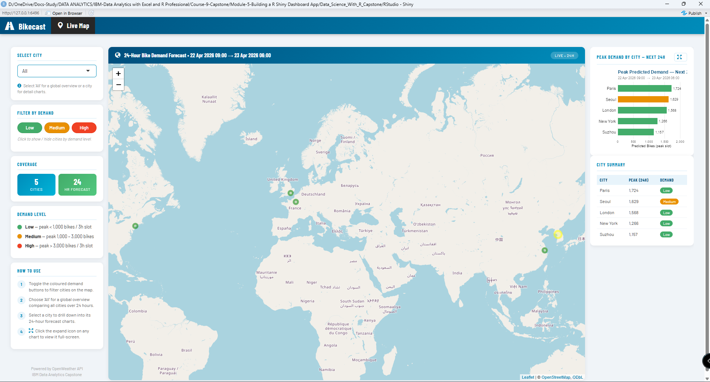
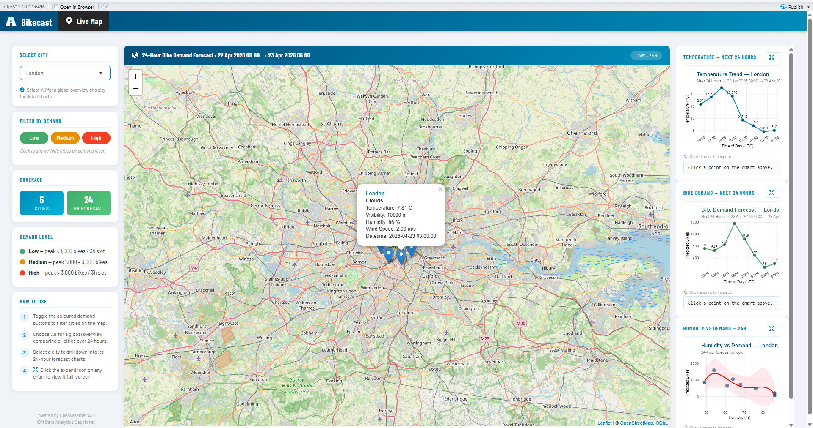
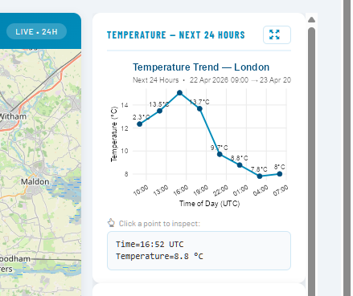
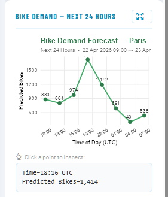
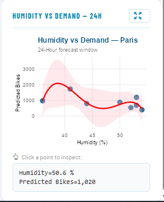

# 🚲 Bike-Sharing Demand Prediction System  

### End-to-End Predictive Analytics & Interactive Dashboard (R + Shiny)

---

## 🏷️ Project Badges


---

## 📌 Project Overview  

This project develops a complete **end-to-end predictive analytics system** to forecast bike-sharing demand using weather and temporal features.

It integrates:

- Data engineering (ETL pipeline)  
- Statistical modeling  
- Real-time API-based predictions  
- Interactive dashboard deployment  

---
## ⚙️ Tech Stack Summary

- **Primary Implementation:** R (IBM Capstone-aligned)
- **Parallel Implementation:** Python (equivalent pipeline)
- **Modeling:** Linear Regression (weather-based demand prediction)
- **Data Sources:**
  - Wikipedia (web scraping)
  - OpenWeather API (forecast data)
  - Seoul Bike Sharing dataset (historical demand)
- **Visualization:** ggplot2, Leaflet (Shiny Dashboard)
---
## 🎯 Business Problem  

Bike-sharing systems require efficient allocation of resources based on demand.

> **How can weather and temporal patterns be used to predict bike demand and optimize operational decisions?**

---

## 📊 Dashboard Preview  

### 🌍 Global Demand Overview  


### 🔍 City Drill-Down  


### 📈 Temperature Trend  


### 🚲 Bike Demand Forecast  


### 💧 Humidity vs Demand  


---

## 📁 Repository Structure  

```
bike-demand-prediction/
│
├── README.md
│
├── data/
│   ├── raw/
│   │   ├── seoul_bike_sharing.csv
│   │   └── selected_cities.csv
│   └── processed/
│       ├── clean_bike_data.csv
│       └── model.csv
│
├── notebooks/
│   ├── Python/
│   │   ├── 01_data_collection_py.ipynb
│   │   ├── 02_etl_py.ipynb
│   │   ├── 03_eda_py.ipynb
│   │   ├── 04_baseline_model_py.ipynb
│   │   ├── 05_model_refinement_py.ipynb
│   │   ├── 06_model_evaluation_py.ipynb
│   │   ├── 07_feature_importance_py.ipynb
│   │   ├── 08_model_selection_py.ipynb
│   │   ├── 09_api_integration_py.ipynb
│   │   ├── 10_prediction_pipeline_py.ipynb
│   │   ├── 11_dashboard_preparation_py.ipynb
│   │   └── 12_final_project_summary_py.ipynb
│   │
│   └── R/
│       ├── 01_data_collection_R.ipynb
│       ├── 02_data_wrangling_R.ipynb
│       ├── 03_exploratory_data_analysis_R.ipynb
│       ├── 04_baseline_model_R.ipynb
│       ├── 05_model_refinement_R.ipynb
│       ├── 06_model_evaluation_R.ipynb
│       ├── 07_feature_importance_R.ipynb
│       ├── 08_model_selection_R.ipynb
│       ├── 09_api_pipeline_R.ipynb
│       ├── 10_dashboard_data_preparation_R.ipynb
│       └── 11_shiny_dashboard_integration_R.ipynb
│
├── reports/
│
├── results/
│   └── screenshots/
│       ├── dashboard_overview.png
│       ├── city_drilldown.png
│       ├── temparature_trend.png
│       ├── bike_demand_next_24_hrs.png
│       └── humidity_vs_demand.png
│
├── shiny_app/
│   ├── model_prediction.R
│   ├── server.R
│   └── ui.R
│
└── .gitignore
```

---

## ▶️ How to Run

### 📌 Quick Start (Recommended)

### 1. Clone the repository:

```bash
git clone https://github.com/deepan-mehta-analytics/bike-demand-prediction.git
cd bike-demand-prediction
```
### 2. Set your OpenWeather API key:
```bash
Sys.setenv(OPENWEATHER_API_KEY="your_api_key")
```
### 3. Run Shiny App  

```r
setwd("shiny_app")
shiny::runApp()
```

---

## 🔑 API Setup  ( see Step 2 above)

```r
Sys.setenv(OPENWEATHER_API_KEY="your_api_key")
```

---

## 👤 Author  

**Deepan Mehta**  

- Data Analytics → Data Engineering → AI/ML Engineering  
- Focused on building end-to-end data systems combining analytics, machine learning, and deployment  
- Experience in ETL pipelines, predictive modeling, and interactive dashboards  

🔗 GitHub: https://github.com/deepan-mehta-analytics  
