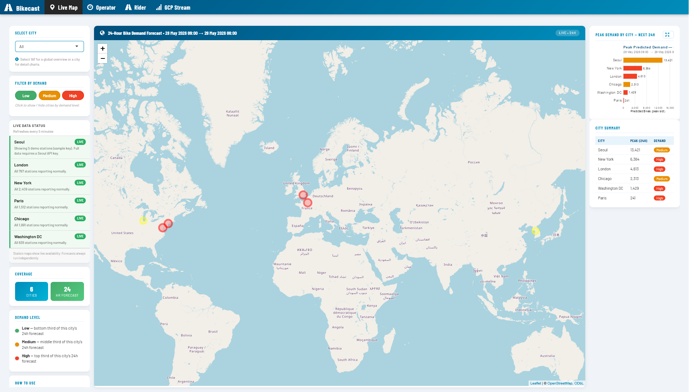
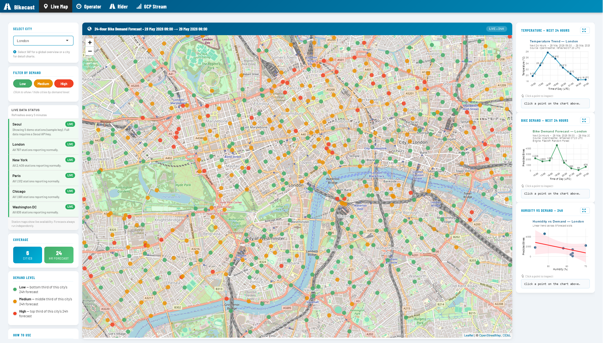
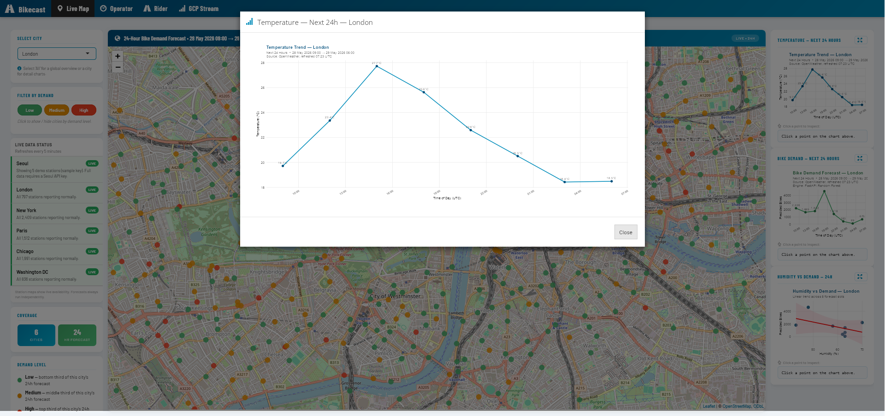
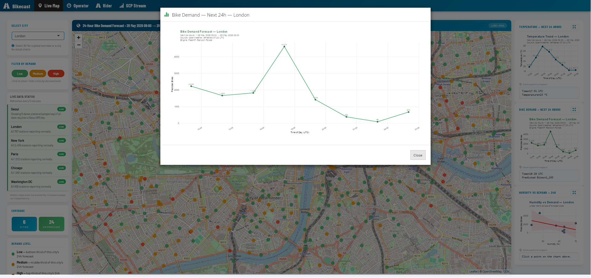
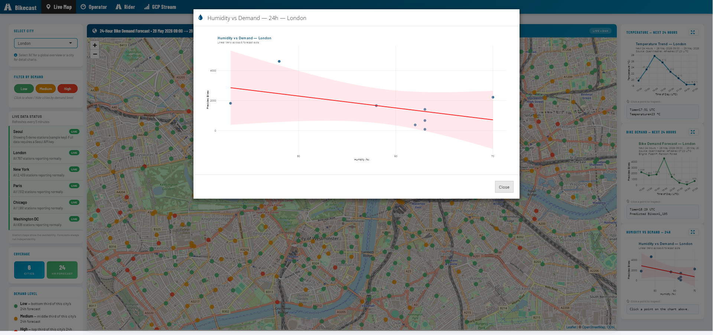

# 🚲 Bike-Sharing Demand Prediction System

---

## ⚡ Quick Summary

This project delivers a full-stack predictive analytics system for bike-sharing demand forecasting, built across two independent language tracks (R and Python) as part of the IBM Applied Data Science with R Capstone. Starting from raw Seoul city data, the system spans ETL pipelines, SQL-based exploratory analysis, multi-model regression benchmarking, and a live Shiny dashboard fed by real-time OpenWeather API data.

The R pipeline benchmarks six model classes on a chronological 80/20 held-out split, achieving a Random Forest with R²=0.730 (RMSE 333.89 bikes/hr) — a 39% improvement over the baseline linear model. The Bikecast Shiny dashboard provides live 24-hour demand forecasts for five global cities rendered on an interactive Leaflet map, with city drill-down showing live GBFS station availability markers, demand-band filtering, and expand-to-modal charts.

**v1.1 is shipped.** Phase 7 extended the dashboard into two real end-user tools: an **Operator tab** (fleet rebalancing alerts, demand vs. station capacity) and a **Rider tab** (live availability score, best-time recommendation, natural-language summary). The prediction backend is upgraded to a Python FastAPI inference service (RF RMSE 173 bikes/hr) replacing the linear model.csv; Docker Compose runs the full stack locally. Next: **GCP streaming pipeline** — GBFS live feeds → Pub/Sub → Dataflow → BigQuery (v1.2, Phase 7F).

### End-to-end ML pipeline: raw Seoul data → six competing models → live global demand forecast

---

## 🏷️ Project Badges

[](https://github.com/deepan-mehta-analytics/bike-demand-prediction/actions/workflows/ci.yml)


---

## 📌 Project Overview

- **Dual-language pipelines** — Parallel R and Python implementations of the complete data science workflow, from raw data ingestion through to model serialisation
- **End-to-end ML** — ETL → SQL EDA → regularised regression → Random Forest → deployed dashboard, all reproducible from source
- **Six models benchmarked** — Baseline OLS, Refined OLS, Ridge, Lasso, Elastic Net, and Random Forest evaluated on a chronological 80/20 held-out split
- **Live weather integration** — Real-time OpenWeather 5-day forecast API feeds the Shiny dashboard with 24-hour demand predictions
- **Five global cities** — Seoul, London, New York, Paris, Chicago rendered on an interactive Leaflet map with colour-coded demand markers
- **IBM Capstone structure** — Three notebook tracks: self-built Python pipeline, self-built R pipeline, and IBM-mandated graded submission R pipeline

---

## ⚙️ Tech Stack

| Layer | Tool | Purpose |
|-------|------|---------|
| Data wrangling | dplyr, tidyr, stringr (R) · pandas, numpy (Py) | Reshape, filter, and clean tabular data |
| Database / SQL | RSQLite, DBI (R) · sqlite3, sqlalchemy (Py) | Local SQLite storage and SQL EDA |
| Modelling | caret, glmnet, randomForest (R) · scikit-learn (Py) | Regularised regression, cross-validation, Random Forest |
| Visualisation | ggplot2, Leaflet (R) · matplotlib, seaborn, plotly (Py) | Statistical plots and interactive maps |
| API integration | httr (R) · requests (Py) | OpenWeather forecast fetch + GBFS live station feeds |
| Live station data | GBFS v2 (NYC / Paris / Chicago) · TfL BikePoint API (London) | Real-time available bikes per station |
| Dashboard | R Shiny, shinythemes (Yeti), shinyjs | Live Bikecast 24-hr demand web app |
| ML inference service *(v1.1)* | Python FastAPI + scikit-learn RF | `/predict` endpoint; RMSE 173 bikes/hr |
| Streaming pipeline *(v1.1)* | GCP Pub/Sub · Apache Beam / Dataflow · BigQuery | GBFS → real-time station event stream → analytics store |
| Containerisation *(v1.1)* | Docker · Docker Compose · GCP Cloud Run | Reproducible local + cloud deployment |
| Development | RStudio, JupyterLab | Notebook authoring and Shiny development |

---

## 🎯 Business Problem

> How can weather and time-of-day patterns be used to forecast hourly bike-sharing demand, enabling operators to pre-position bikes, balance station inventory, and reduce rebalancing costs across global city networks?

The Seoul Bike Sharing dataset provides 8,760 hourly observations (Jan 2017 – Nov 2018), combining weather measurements with ridership counts. The system learns these patterns and generalises them to five peer cities using live weather forecasts.

---

## 🏗️ Architecture

```
┌──────────────────────────────────────────────────────────────────┐
│                         DATA LAYER                               │
│  Seoul UCI dataset (CSV) ──► RSQLite / sqlite3 (local DB)        │
│  OpenWeather 5-day API ────► raw_cities_weather_forecast.csv      │
│  Peer cities lookup ───────► selected_cities.csv                  │
└──────────────────────────────┬───────────────────────────────────┘
                               │
┌──────────────────────────────▼───────────────────────────────────┐
│                       PIPELINE LAYER                             │
│                                                                  │
│   Track 1 — Python                  Track 2 — R                  │
│   NB 01 Data Collection             NB 01 Data Collection         │
│   NB 02 ETL / Wrangling             NB 02 Data Wrangling          │
│   NB 03 SQL EDA                     NB 03 SQL EDA                 │
│   NB 04 Baseline Model              NB 04 Baseline Model          │
│   NB 05 Model Refinement            NB 05 Model Refinement        │
│   NB 06 Evaluation & Diagnostics    NB 06 Evaluation              │
│   NB 07 Feature Importance          NB 07 Feature Importance      │
│   NB 08 Model Selection ──────────► my_trained_model.rds / .pkl  │
│   NB 09 API Integration             NB 09 API Pipeline            │
│   NB 10 Prediction Pipeline         NB 10 Dashboard Data Prep     │
│   NB 11 Dashboard Prep              NB 11 Shiny Integration       │
│   NB 12 Project Summary                                           │
│                                                                  │
│   Track 3 — R (IBM Graded Submission, notebooks 04–08)           │
└──────────────────────────────┬───────────────────────────────────┘
                               │
┌──────────────────────────────▼───────────────────────────────────┐
│                     DEPLOYMENT LAYER                             │
│  IBM model.csv ──────────► shiny_app/ (Bikecast dashboard)       │
│  OpenWeather API ────────►   ui.R + server.R + model_prediction.R │
│  GBFS / TfL feeds ───────►   gbfs_client.R → station markers      │
│  Leaflet map, demand bands, city drill-down, expand-to-modal     │
└──────────────────────────┬───────────────────────────────────────┘
                           │
┌──────────────────────────▼───────────────────────────────────────┐
│          REAL USE-CASE LAYER  (v1.1 — in development)            │
│                                                                  │
│  GBFS live feeds ──► Pub/Sub topic ──► Dataflow pipeline         │
│                                              │                   │
│                                              ▼                   │
│  Python FastAPI /predict  ◄────── BigQuery station_events        │
│         │                                                        │
│         ▼                                                        │
│  Shiny UC1 Operator tab   — demand vs capacity, rebalancing      │
│  Shiny UC2 Rider tab      — live availability, best-time score   │
└──────────────────────────────────────────────────────────────────┘
```

| Layer | Component | Technology |
|-------|-----------|------------|
| Data ingestion | UCI dataset + peer cities + API fetch | R httr / Python requests |
| Storage | Local SQLite database | RSQLite / sqlite3 |
| ETL | Wrangling, normalisation, feature engineering | dplyr / pandas |
| Exploration | SQL queries + visual EDA | ggplot2 / matplotlib, seaborn |
| Modelling | Baseline → Ridge → Lasso → Elastic Net → Random Forest | caret, glmnet, randomForest / scikit-learn |
| Serialisation | Model artefact persistence | RDS + CSV / joblib pkl |
| Dashboard | Live 24-hr forecast + interactive Leaflet map | R Shiny, shinythemes, shinyjs |

---

## 📓 Notebook Tracks — Important Context

This repository contains **three parallel notebook tracks**.

| # | Language | Folder | Purpose |
|---|----------|--------|---------|
| 1 | Python | `notebooks/Python/` | Exploratory parallel implementation of the full pipeline |
| 2 | R | `notebooks/R/` | Full self-built R pipeline — produces own trained model |
| 3 | R | `notebooks/R_submission/` | IBM Coursera-mandated pipeline used for graded submission and presentation |

### Why three tracks?

The capstone runs in two stages:

**Modules 1–4 (self-directed):** The pipeline was built independently. Both Python and R implementations were developed in parallel.

**Module 5 (graded submission):** IBM Coursera provided a specific set of R starter notebooks and their own pre-trained `model.csv` for the Shiny dashboard. The notebooks were completed, all graded artefacts were produced, and those results were used for the capstone presentation.

> The presentation is based on the submission track.  
> The Shiny app uses the IBM-provided deployment model (`model.csv`), which differs from the self-trained models developed in the R pipeline.

This separation reflects real-world machine learning workflows, where experimentation, validation, and deployment often rely on different model pipelines.

---

## 📊 Dashboard Preview

### 🌍 Global Demand Overview


### 🔍 City Drill-Down


### 📈 Temperature Trend


### 🚲 Bike Demand Forecast — Next 24 Hours


### 💧 Humidity vs Demand Correlation


---

## 📁 Repository Structure

```
bike-demand-prediction/
│
├── README.md
│
├── data/
│   ├── raw/
│   │   ├── seoul_bike_sharing.csv              # Original Seoul dataset (UCI)
│   │   └── selected_cities.csv                 # 5 peer cities with lat/lng
│   └── processed/
│       ├── clean_bike_data.csv                 # Wrangled, complete-case dataset
│       └── model.csv                           # IBM-provided model (used by Shiny app)
│
├── notebooks/
│   │
│   ├── Python/                                 # ── TRACK 1: Python pipeline
│   │   ├── 01_data_collection_py.ipynb
│   │   ├── 02_etl_py.ipynb
│   │   ├── 03_eda_py.ipynb
│   │   ├── 04_baseline_model_py.ipynb
│   │   ├── 05_model_refinement_py.ipynb
│   │   ├── 06_model_evaluation_py.ipynb
│   │   ├── 07_feature_importance_py.ipynb
│   │   ├── 08_model_selection_py.ipynb
│   │   ├── 09_api_integration_py.ipynb
│   │   ├── 10_prediction_pipeline_py.ipynb
│   │   ├── 11_dashboard_preparation_py.ipynb
│   │   └── 12_final_project_summary_py.ipynb
│   │
│   ├── R/                                      # ── TRACK 2: R self-built pipeline
│   │   ├── 01_data_collection_R.ipynb
│   │   ├── 02_data_wrangling_R.ipynb
│   │   ├── 03_exploratory_data_analysis_R.ipynb
│   │   ├── 04_baseline_model_R.ipynb
│   │   ├── 05_model_refinement_R.ipynb
│   │   ├── 06_model_evaluation_R.ipynb
│   │   ├── 07_feature_importance_R.ipynb
│   │   ├── 08_model_selection_R.ipynb          # → produces my_trained_model.csv/.rds
│   │   ├── 09_api_pipeline_R.ipynb
│   │   ├── 10_dashboard_data_preparation_R.ipynb
│   │   └── 11_shiny_dashboard_integration_R.ipynb
│   │
│   └── R_submission/                           # ── TRACK 3: IBM graded submission
│       ├── 01_data_collection_R.ipynb
│       ├── 02_data_wrangling_R.ipynb
│       ├── 03_exploratory_data_analysis_R.ipynb
│       ├── 04_baseline_model_R.ipynb
│       ├── 05_model_refinement_R.ipynb
│       ├── 06_model_evaluation_diagnostics_R.ipynb
│       ├── 07_feature_importance_R.ipynb
│       ├── 08_final_model_selection_R.ipynb
│       ├── 09_api_data_collection_and_prediction_pipeline_R.ipynb
│       ├── 10_dashboard_data_preparation_R.ipynb
│       └── 11_shiny_dashboard_integration_R.ipynb
│
├── reports/
│   └── Applied_Data_Science_with_R_Capstone_project.pdf   ← capstone presentation (PDF)
│
├── results/
│   ├── models/
│   │   ├── my_trained_model.csv                # Model comparison table — all 6 evaluated models
│   │   ├── my_trained_model.rds                # Serialised Random Forest model object (R binary)
│   │   └── final_bike_demand_model.pkl         # Serialised Random Forest model object (Python/joblib)
│   └── screenshots/
│       ├── dashboard_overview.png
│       ├── city_drilldown.png
│       ├── temperature_trend.png
│       ├── bike_demand_next_24_hrs.png
│       └── humidity_vs_demand.png
│
├── config/                                     # ── Phase 7 configuration
│   ├── cities.yaml                             # GBFS URLs, BigQuery datasets, timezones per city
│   └── gcp_config.yaml                         # Pub/Sub topic, BigQuery dataset, local-mode paths
│
├── shiny_app/                                  # ── Bikecast dashboard
│   ├── ui.R
│   ├── server.R
│   ├── model_prediction.R
│   └── gbfs_client.R                           # Live GBFS / TfL station data client (Phase 7B)
│
├── Dockerfile.shiny                            # Containerises R Shiny app (rocker/shiny:4.4.3 + renv)
├── docker-compose.yml                          # Orchestrates Shiny + FastAPI services locally
│
└── .gitignore
```

---

## 🤖 Model Summary

Two model pipelines exist in this project, corresponding to each stage of the programme.

### Trained Model — Random Forest Regressor ★
*Track 2 · `notebooks/R/08_model_selection_R.ipynb` · `results/models/my_trained_model.rds`*

Trained on the Seoul Bike Sharing dataset using a chronological 80/20 train-test split
(200 estimators, full feature set, seed 123). Five model classes evaluated on held-out test data.

| Model | Specification | Test RMSE | Test R² |
|-------|--------------|-----------|---------|
| Baseline OLS | temperature + humidity + wind_speed | 549.03 | 0.338 |
| Refined OLS | + temp², humidity², temp×humidity | 509.53 | 0.385 |
| Ridge (α=0) | Full feature set, λ via 10-fold CV | 437.25 | 0.518 |
| Lasso (α=1) | Full feature set, λ via 10-fold CV | 417.52 | 0.536 |
| Elastic Net (α=0.5) | Full feature set, λ via 10-fold CV | 417.54 | 0.536 |
| **Random Forest ★** | **200 trees, full feature set** | **333.89** | **0.730** |

Random Forest achieves a **39% RMSE reduction over the baseline** and explains **73% of variance**
in held-out data — a 19.4 percentage point improvement over the best regularised linear model.
Top predictors by importance: temperature, hour, dew point temperature, humidity, solar radiation.

### Trained Model — Python Track
*Track 1 · `notebooks/Python/08_model_selection_py.ipynb` · `results/models/final_bike_demand_model.pkl`*

Trained on the normalised Seoul dataset using a chronological 80/20 split and serialised via joblib.
The ETL stage applies min-max scaling to all numeric columns; RMSE values below are reported in original units (bikes/hr) via inverse transform: `x = x_norm × (y_max − y_min) + y_min` (y_min=2, y_max=3556).

| Model | Test R² | Test RMSE (bikes/hr) |
|-------|---------|----------------------|
| Polynomial (degree=2) | 0.271 | 462.0 |
| Ridge | 0.430 | 408.7 |
| Lasso | −0.077 | 565.1 |
| Elastic Net | −0.077 | 565.1 |
| **Random Forest ★** | **0.518** | **376.7** |

Random Forest is the selected model. Lasso and Elastic Net produce negative R² at this
regularisation strength (α=0.1), indicating over-penalisation on a normalised target.
Track 2 achieves higher R² (0.730) and lower RMSE (333.89 bikes/hr) through richer feature
engineering and original-scale modelling — a 42.8 bike/hr improvement over the Python RF.

### IBM Deployed Model
*Track 3 · provided by IBM Skills Network · `data/processed/model.csv`*

Used by the Bikecast Shiny app. A fixed-effects linear model with weather coefficients plus per-season and per-hour offsets, applied via `model_prediction.R`.

```
PREDICTED_BIKES =
    938.84
  + TEMPERATURE  × 25.18
  + HUMIDITY     × (−8.45)
  + WIND_SPEED   × 2.42
  + VISIBILITY   × 0.007
  + season_offset   # SPRING +2.32 | AUTUMN +160.19 | WINTER −204.27
  + hour_offset     # 24 individual offsets, floored at 0 via pmax()
```

Scored on the same held-out test set as Track 2 (chronological 80/20 split, Sep–Nov 2018):

| Metric | IBM Linear (model.csv) | Random Forest ★ (Track 2) |
|--------|------------------------|---------------------------|
| Test RMSE | 342.60 bikes/hr | **333.89 bikes/hr** |
| Test R² | 0.6723 | **0.7305** |

The IBM fixed-effects linear model outperforms every regularised model in Track 2 (Ridge, Lasso, Elastic Net) and comes within 8.7 bikes/hr of the Random Forest — a strong result for a linear model, attributable to its 24 individual hour offsets capturing the daily demand cycle with precision.

---

## 🔍 Key EDA Findings

| Finding | Detail | Source |
|---------|--------|--------|
| 🕕 Peak hours | 17:00–19:00 (evening commute) | SQL Query 7 |
| 🌡️ Top predictor | Temperature — strong positive linear relationship | Notebooks 07/08 |
| 📅 Seasonal swing | Summer avg 1,034 bikes/hr vs Winter 226 — a 4.6× range | SQL Query 9 |
| 💧 Humidity response | Concave: positive at low %, suppressive at high % | Notebook 05 |
| 🌧️ Precipitation | Even <1mm rainfall significantly reduces demand | EDA viz |
| 🕐 Daily cycle | Bimodal peaks at 08:00 and 18:00; near-zero 01:00–05:00 | SQL Query 8 |

---

## 🚀 Bikecast — R Shiny Dashboard

A professional three-column dashboard built on the **Yeti Bootswatch** theme.

**Features (v1.0):**
- Live 24-hour forecast via OpenWeather API (8 × 3-hour slots)
- Interactive Leaflet map with colour-coded demand markers
- Demand filter toggle buttons (Low / Medium / High)
- City drill-down with three charts — all click-to-inspect
- Expand-to-modal on every chart for full-screen view
- City comparison bar chart + summary table in the global overview
- **Live GBFS station markers** — city drill-down shows individual stations coloured by current available bike count (green ≥ 5 / yellow 1–4 / red 0); popups show station name, bikes available, free docks, and capacity *(Phase 7B)*

**Features (v1.1 — shipped):**
- **FastAPI prediction engine** — RF model (RMSE 173 bikes/hr) replaces linear model.csv; 2× accuracy improvement; `USE_FASTAPI` env var switches engines *(Phase 7C ✅)*
- **Operator tab (UC1)** — fleet rebalancing alerts, demand vs. station capacity heatmap, CSV export of 24-hr forecast *(Phase 7D ✅)*
- **Rider tab (UC2)** — demand score (Low / Medium / High) for next 3 hours, best-time-to-ride recommendation, natural-language availability summary *(Phase 7E ✅)*
- **Docker Compose deployment** — `docker compose up` runs the full Shiny + FastAPI stack locally *(Phase 7H ✅)*

**In development (v1.2):**
- **GCP Streaming Pipeline** — GBFS feeds → Pub/Sub → Dataflow → BigQuery *(Phase 7F)*
- **Seoul live stations** — GBFS integration pending Seoul Open API key registration

**Demand bands:**

| Level | Bikes per 3h slot | Map Marker |
|-------|------------------|------------|
| 🟢 Low | < 1,000 | Green, radius 6 |
| 🟡 Medium | 1,000 – 3,000 | Yellow, radius 10 |
| 🔴 High | > 3,000 | Red, radius 12 |

**Cities covered:** Seoul · London · New York · Paris · Chicago

---

## ▶️ How to Run

### 1. Clone the repository

```bash
git clone https://github.com/deepan-mehta-analytics/bike-demand-prediction.git
cd bike-demand-prediction
```

### 2. Set your OpenWeather API key

Get a free key at [openweathermap.org](https://home.openweathermap.org/api_keys). Store it securely — **never paste it directly into code**.

```r
# Run this in your R console to open .Renviron:
usethis::edit_r_environ()
```

Add this line and save:
```
OPENWEATHER_KEY=your_actual_key_here
```

Restart R. New keys can take up to **2 hours** to activate on OpenWeather's free tier.

### 3. Install dependencies

**R packages (recommended — uses pinned versions from `renv.lock`):**
```r
renv::restore()
```

**R packages (alternative — installs latest CRAN versions):**
```r
source("install_packages.R")
```

**Python packages:**
```bash
pip install -r requirements.txt
```

### 4. Run the Shiny app

```r
shiny::runApp("shiny_app/")
```

All Shiny-specific packages install automatically on first run if not already present.

### 5. Run with Docker

**Shiny app only (standalone):**

```bash
docker build -f Dockerfile.shiny -t bikecast-shiny:latest .
docker run -p 3838:3838 -e OPENWEATHER_KEY=your_actual_key_here bikecast-shiny:latest
```

The app will be available at `http://localhost:3838/`.

**Full stack with Docker Compose** (Shiny + FastAPI; requires the [bike-demand-ml-system](https://github.com/deepan-mehta-analytics/bike-demand-ml-system) repo cloned as a sibling directory):

```bash
# Create .env in the repo root:
echo "OPENWEATHER_KEY=your_actual_key_here" > .env

docker compose up
```

Shiny at `http://localhost:3838/` · FastAPI at `http://localhost:8000/docs`.

---

## 🧪 Tests

No automated test suite is implemented in this capstone project. Correctness is verified through:

- **Chronological 80/20 train/test split** — time-aware holdout prevents data leakage by design
- **RMSE and R² on held-out test data** — all model numbers reported from the unseen test set
- **Dashboard manual validation** — Shiny app verified against live OpenWeather responses

> Automated test coverage (pytest / testthat) is listed in the Roadmap below.

---

## 📄 Presentation

The capstone presentation covers the full pipeline from data collection through to the live dashboard.

> **`reports/Applied_Data_Science_with_R_Capstone_project.pdf`**

| Slides | Content |
|--------|---------|
| 1–13 | Executive summary, introduction, methodology |
| 14–20 | EDA results — SQL queries, seasonality, peer-city analysis |
| 21–25 | Visualisation results — scatter plots, histogram, precipitation |
| 26–30 | Modelling — coefficients, RMSE/R² comparison, Q-Q diagnostics |
| 31–34 | Bikecast dashboard screenshots and technical walkthrough |
| 35–52 | Conclusion, appendix, references |

> Results on slides 26–30 are based on the IBM submission notebooks (`notebooks/R_submission/`). The Shiny app uses the IBM-provided `model.csv` rather than the self-trained Random Forest — both models are documented in the Model Summary section above.

---

## ⚠️ Known Limitations

- **Python RF weaker than R RF** — Python Random Forest achieves R²=0.518 / RMSE=376.7 bikes/hr vs R Track R²=0.730 / RMSE=333.89; gap is attributable to richer feature engineering and original-scale modelling in the R pipeline
- **Lasso / Elastic Net over-penalised on Python track** — both produce negative R² at α=0.1 on the normalised target, indicating regularisation is too aggressive at that scale
- **IBM model scored on Track 2 test set** — RMSE 342.60, R² 0.6723; see IBM Deployed Model section for full comparison
- **OpenWeather free tier limits** — new API keys take up to 2 hours to activate; rate limits apply at scale
- **renv library not included** — `renv/library/` is gitignored (platform-specific binaries); run `renv::restore()` to rebuild the local library from `renv.lock`

---

## 🔜 Roadmap

### ✅ v1.0.0 — Released (2026-05-07)

- [x] Convert Python RMSE to original scale — inverse min-max; RF RMSE 376.7 bikes/hr
- [x] `requirements.txt` (Python) and `install_packages.R` (R) added
- [x] IBM model scored on held-out test set — RMSE 342.60, R² 0.6723
- [x] Pin R packages via `renv::snapshot()` — `renv.lock` (R 4.4.3, 139 packages pinned)
- [x] Add MIT LICENSE (2026, Deepan Mehta)
- [x] Add GitHub Actions CI — Python + R smoke tests, `model.csv` integrity check

### 🔄 v1.1 — In Development

#### Phase 7A — City Replacement ✅
- [x] Replace Suzhou (no GBFS) with Chicago (Divvy GBFS v2)
- [x] `config/cities.yaml` — GBFS URLs, BigQuery datasets, timezones for all 5 cities
- [x] `config/gcp_config.yaml` — Pub/Sub topic, BigQuery dataset, local-mode paths

#### Phase 7B — Live Station Data ✅
- [x] `shiny_app/gbfs_client.R` — GBFS v2 client (NYC, Paris, Chicago) + TfL BikePoint (London)
- [x] City drill-down map: individual station markers coloured by available bike count
- [x] Graceful fallback — GBFS failure never crashes the app

#### Phase 7C — FastAPI Integration ✅
- [x] Wire `httr::POST` to Python FastAPI `/predict` in `model_prediction.R`
- [x] `USE_FASTAPI` env var switches prediction engine (FastAPI RF vs model.csv fallback)
- [x] `docker-compose.yml` — Shiny + FastAPI as co-located services

#### Phase 7D — UC1 Operator Tab ✅
- [x] New Shiny tab: demand vs. station capacity alerts (predicted demand > available bikes)
- [x] Fleet rebalancing heatmap layer on Leaflet
- [x] CSV export of 24-hr demand forecast for operations teams

#### Phase 7E — UC2 Rider Tab ✅
- [x] New Shiny tab: demand score (Low / Medium / High) for next 3 hours
- [x] "Best time to ride today" recommendation
- [x] Natural-language summary: available bikes at nearest station

#### Phase 7F — GCP Streaming Pipeline 🔲
- [ ] `pipeline/gbfs_to_pubsub.py` — GBFS poller → Pub/Sub (`USE_PUBSUB=false` runs locally)
- [ ] `pipeline/dataflow_job.py` — Apache Beam: Pub/Sub → BigQuery windowed aggregation
- [ ] Local mode: DirectRunner + DuckDB (no GCP account required)

#### Phase 7G — Documentation ✅
- [x] README architecture diagram updated with full v1.1 stack
- [x] Tech Stack and Roadmap updated for Phase 7 scope

#### Phase 7H — Containerisation & CI ✅
- [x] `Dockerfile.shiny` — rocker/shiny:4.4.3 base, renv restore via PPM, EXPOSE 3838
- [x] CI extended with Docker Compose smoke test (`docker-compose-build` job)

### 🔮 Backlog

- [ ] pytest / testthat unit tests for ETL and model evaluation functions
- [ ] Seoul GBFS integration (free API key at data.seoul.go.kr)
- [ ] Expand to 8 cities (Washington DC, San Francisco, or Amsterdam)

---

## 📂 Dataset

| Attribute | Detail |
|-----------|--------|
| **Name** | Seoul Bike Sharing Demand |
| **Source** | UCI Machine Learning Repository |
| **Records** | 8,760 hourly observations |
| **Period** | January 2017 – November 2018 |
| **Features** | 14 — weather (temperature, humidity, wind speed, visibility, solar radiation, rainfall, snowfall) + temporal (date, hour, season, holiday, functioning day) |
| **Target** | `rented_bike_count` — bikes rented per hour |
| **License** | Creative Commons Attribution 4.0 |

Sathishkumar V.E., Park J., Cho Y. (2020). *Using data mining techniques for bike sharing demand prediction in metropolitan city.* Computer Communications, 153, 353–366.

---

## 👤 Author

**Deepan Mehta**

Data Analytics → Data Engineering → AI/ML Engineering

Focused on building end-to-end data systems combining analytics, machine learning, and deployment. Experience in ETL pipelines, predictive modelling, and interactive dashboards.

🔗 GitHub: [deepan-mehta-analytics](https://github.com/deepan-mehta-analytics)

---

## 📚 References

1. Sathishkumar V.E., Park J., Cho Y. (2020). *Using data mining techniques for bike sharing demand prediction in metropolitan city.* Computer Communications, 153, 353–366.
2. Seoul Bike Sharing Demand Dataset — UCI Machine Learning Repository
3. Luo Y., Grossman J., Ahuja R. et al. — IBM Skills Network / Coursera: *IBM Data Analytics Professional with Excel and R*
4. OpenWeather 5-Day Forecast API — https://openweathermap.org/forecast5

---
